```{r setup, include=FALSE}
knitr::opts_chunk$set(echo = FALSE)
```

# Planilhas

--- 

Os programas de planilhas eletrônicas são interfaces gráficas muito úteis para projetar tabelas de dados e lidar com funções básicas de controle de qualidade de dados.

```{r, out.width = "400px", fig.align = "center"}
knitr::include_graphics("https://http2.mlstatic.com/centenas-de-planilhas-excel-prontas-100-editaveis-D_NQ_NP_14094-MLB3478257526_122012-F.jpg")

knitr::include_graphics("https://exceleasy.com.br/wp-content/uploads/2017/11/Deixar-planilha-mais-bonita-no-excel.png")
```

## Uso _prudente_ de planilhas

Planilhas são boas para entrada de dados E por isso, temos muitos dados em planilhas. 

```{r, out.width = "400px", fig.align = "center"}
knitr::include_graphics("https://blog.luz.vc/wp-content/uploads/2014/05/Capturar-111.png")
``` 

+ _Alguém tem dados salvos em formato de texto?_
```{r, out.width = "350px", fig.align = "center"}
knitr::include_graphics("http://www.tutoriaisword.com/Localizar-e-mostrar-as-celulas-vazias-de-uma-tabela/tabela-com-celulas-vazias.jpg")
```

---

```{r, out.width = "800px", fig.align = "center"}
knitr::include_graphics("https://media2.giphy.com/media/l9Tllo1thElT5gvVOU/giphy.gif")
```

## _**Mas**_ ...

+ Muitas vezes são utilizadas também para:

  + criar tabelas de dados para publicações; 
  
  + gerar estatísticas resumidas;
  
  + fazer figuras.


---

- criar tabelas de dados para publicações

```{r, out.width = "750px", fig.align = "center"}
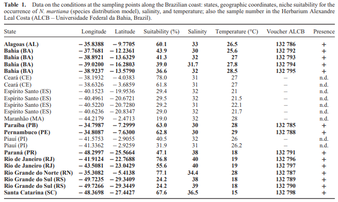
```

^[AFFE, H. M. J. _et al._ _Nitzschia martiana_ (CA Agardh) Van Heurck (Bacillariophyceae): distribution modelling and new records along the Brazilian coast. **Diatom Research**, v. 34, n. 1, p. 23-31, 2019.]^ 
[link](https://www.tandfonline.com/doi/full/10.1080/0269249X.2019.1589582)


---

```{r, out.width = "800px", fig.align = "center"}
knitr::include_graphics("figs/fig2.jpg")
```

^[VIDAL, C. Y. et al. Heterogenization of remaining biodiversity in fragmented tropical forests across agricultural landscapes. bioRxiv, p. 629782, 2019.]^
[link](https://www.biorxiv.org/content/10.1101/629782v1.full)

---

### Recomendação é usar um editor de texto

```{r, out.width = "400px", fig.align = "center"}

```

---

- gerar estatísticas resumidas

```{r, out.width = "900px", fig.align = "center"}
knitr::include_graphics("https://a.fsdn.com/con/app/proj/yts/screenshots/ExportToExcel.jpg/max/max/1")
```

---

- fazer figuras

```{r, out.width = "500px", fig.align = "center"}
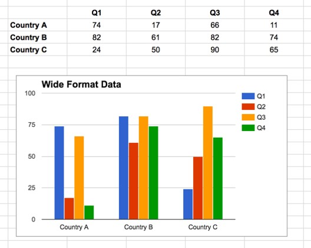
```


## Ainda assim ....

há circunstâncias em que você pode querer usar um programa de planilha para produzir cálculos ou números “rápidos e sujos”, e a limpeza de dados ajudará você a usar alguns desses recursos.

```{r, out.width = "400px", fig.align = "center"}
knitr::include_graphics("https://blog.luz.vc/wp-content/uploads/2014/09/Planilha-Feia-3.jpg")
```

Aqui, vamos supor que você provavelmente está usando o Excel como seu programa de planilha principal - há outros (e.g. Calc do OpenOffice) e sua funcionalidade é semelhante, mas o Excel parece ser o programa mais usado por biólogos.


## Hoje, vamos falar sobre:
 
- Formatação tabelas de dados em planilhas 

- Problemas de formatação 

- Exportando dados

- Controle de qualidade 

# Uma boa <u>organização de dados</u> é a base de qualquer projeto de pesquisa ! {.bigger .vcenter}

## Formatação tabelas de dados {.smaller}
Principais erros

- Tratar programas de planilhas como caderno
  - anotações na margem
  - layout espacial de dados
  - campos para transmitir informações. 

```{r, out.width = "700px", fig.align = "center"}
knitr::include_graphics("figs/fig5.png")
```

## Computadores não veem as informações da mesma maneira que humanos

- Poder dos computadores, 
- podemos gerenciar e analisar dados de maneiras muito mais eficazes
- precisamos configurar nossos dados (os computadores são muito literais).

```{r, out.width = "450px", fig.align = "center"}
knitr::include_graphics("https://datacarpentry.org/spreadsheet-ecology-lesson/fig/single-info.png")
```

## Organização

É extremamente importante configurar tabelas bem formatadas desde o início. 

+ **Pense bem antes de começar**
```{r, out.width = "400px", fig.align = "center"}
knitr::include_graphics("http://mentirinhas.com.br/wp-content/uploads/2018/06/xhoro_26.jpg.pagespeed.ic.5fao6NRAw8.jpg")
```


## Reprodutibilidade
Planilha inicial ≠ planilha final

Para reproduzir as análises:

- Crie um novo arquivo com seus dados limpos ou analisados. Não modifique o conjunto de dados original ou você nunca saberá onde começou.

+ Registre as etapas que você realizou na sua limpeza, como faria em qualquer etapa de um experimento, em arquivo de texto simples armazenado na mesma pasta que o arquivo de dados. (Metadados)

+
```{r, out.width = "700px", fig.align = "center"}
knitr::include_graphics("https://datacarpentry.org/spreadsheet-ecology-lesson/fig/spreadsheet-setup-updated.png")
```


## Estrutura
As regras principais do uso de programas de planilha eletrônica para dados:

- Coloque todas as suas variáveis em colunas - o que você está medindo, como "peso" ou "temperatura".

- Coloque cada observação em sua própria linha.

- Não combine várias informações em uma só célula. 

- Mantenha os dados brutos - não o altere!

- Exporte os dados limpos para um formato baseado em texto, como o formato CSV (valores separados por vírgula). Isso garante que qualquer pessoa possa usar os dados e é exigida pela maioria dos repositórios de dados.

## A regra é clara ! {.bigger .vcenter}

<div class="columns-2">

```{r, out.width = "200px", fig.align = "left"}
knitr::include_graphics("https://vignette.wikia.nocookie.net/factpile/images/6/66/Lotr-boromir-1280jpg-b6a4d5_1280w.jpg/revision/latest?cb=20160331232305")
```

<!-- + A regra básica é: -->

- [**colunas = variáveis**]()

- [**linhas = observações**]()

- [**células = dados (valores)**]()

</div>

+
```{r, out.width = "600px", fig.align = "center"}
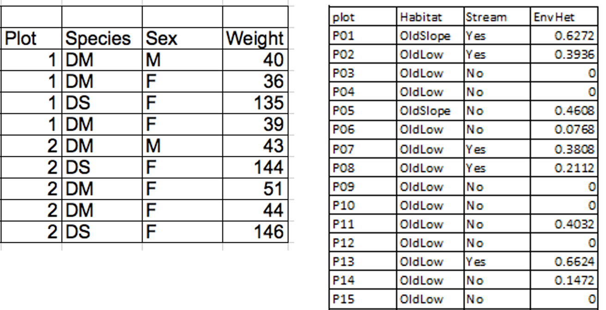
```

## Pontos chave {.bigger .vcenter}

+ Nunca modifique seus dados brutos. Sempre faça uma cópia antes de fazer qualquer alteração.

+ Registre todos os seus passos para limpar seus dados em um arquivo de texto simples.

+ Organize seus dados de acordo com os princípios de dados organizados.


# Problemas de formatação {.bigger .vcenter}

## Principais problemas

- Usando várias tabelas 
- Usando várias guias 
- Não preenchendo zeros 
- Usando valores nulos problemáticos 
- Usando formatação para transmitir informações 
- Usando a formatação para tornar a folha de dados bonita
- Colocar comentários ou unidades nas células 
- Inserindo mais de uma informação em uma célula 
- Usando nomes de campo problemáticos 
- Usando caracteres especiais em dados 
- Inclusão de metadados na tabela de dados 

## Usando várias tabelas 

```{r, out.width = "900px", fig.align = "center"}
knitr::include_graphics("https://datacarpentry.org/spreadsheet-ecology-lesson/fig/2_datasheet_example.jpg")
```

## Usando várias guias (abas)

```{r, out.width = "600px", fig.align = "center"}
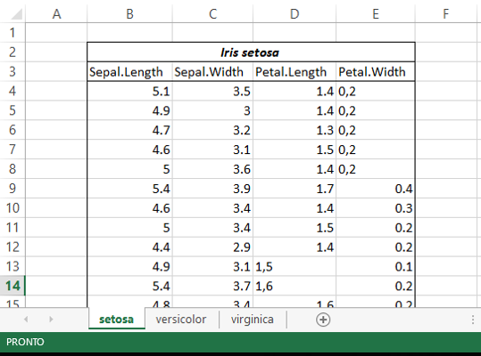
```

## Não preenchendo zeros 

```{r, out.width = "800px", fig.align = "center"}
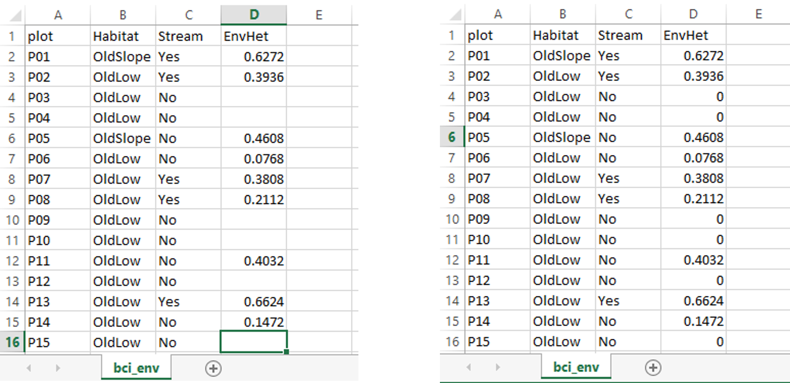
```

## Usando valores nulos problemáticos 

```{r, out.width = "600px", fig.align = "center"}
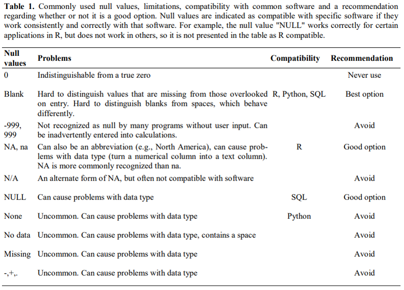
```

^[White, Ethan P., et al. "Nine simple ways to make it easier to (re) use your data." Ideas in Ecology and Evolution 6.2 (2013).]^

## Usando formatação para transmitir informações

```{r, out.width = "600px", fig.align = "center"}
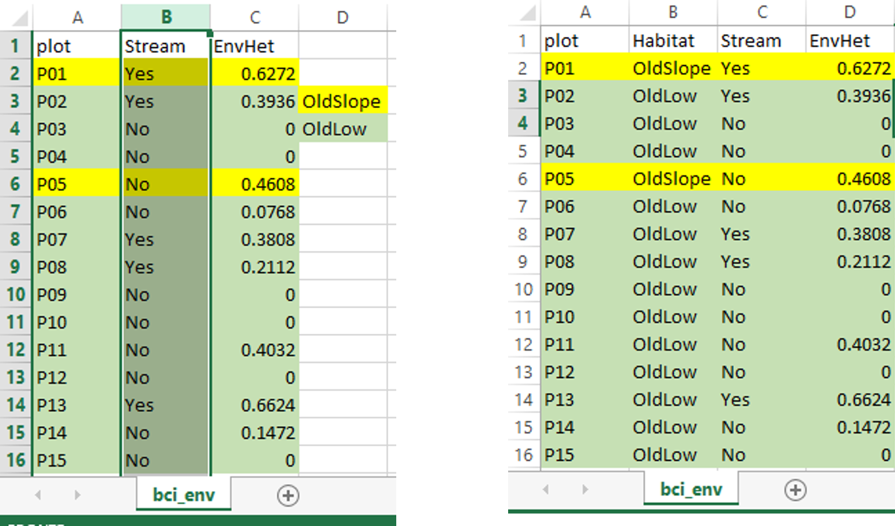
```

## Usando a formatação para tornar a planilha 'bonita'

```{r, out.width = "600px", fig.align = "center"}
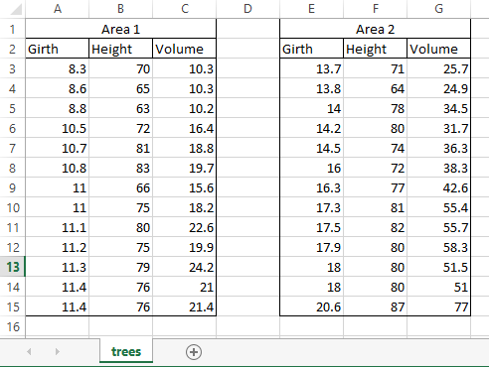
```

## Colocar comentários ou unidades nas células 

```{r, out.width = "800px", fig.align = "center"}
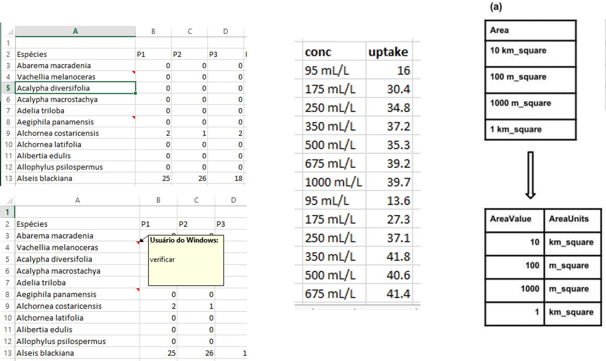
```

## Inserindo mais de uma informação em uma célula 

```{r, out.width = "800px", fig.align = "center"}
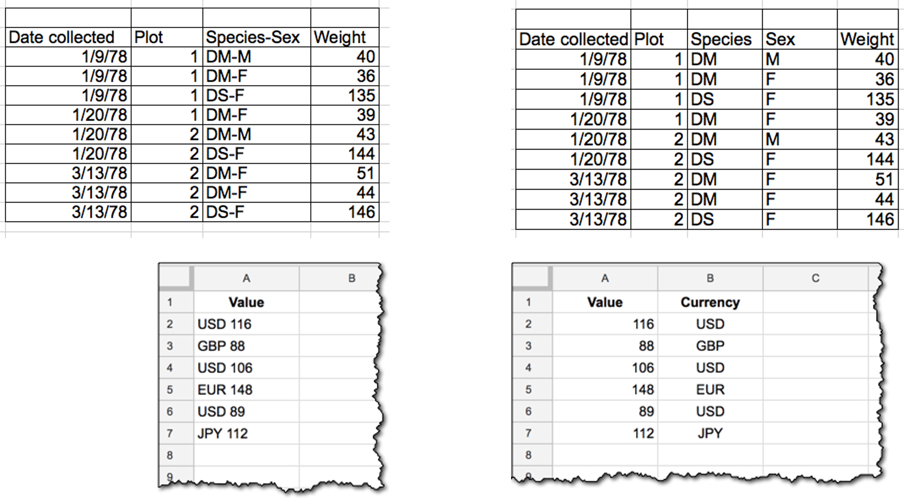
```

## Usando nomes de campo problemáticos 

```{r, out.width = "800px", fig.align = "center"}
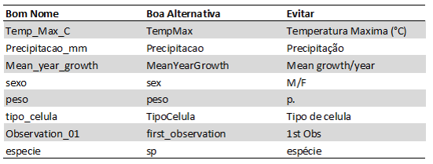
```

## Usando caracteres especiais em dados 

- quebras de linha, 
- travessões 

- formatação 
- caracteres não-padrão sofisticados (como aspas à esquerda e à direita) 
- etc. 

+ Ao exportar esses dados, podem ocorrer coisas perigosas, como:
  - linhas sendo cortadas ao meio 
  - erros de codificação

+ Trate uma célula como se fosse um simples formulário da web que só pode conter texto e espaços.

## Inclusão de metadados na tabela de dados 

+
```{r, out.width = "800px", fig.align = "center"}
knitr::include_graphics("https://media1.tenor.com/images/76413e9fc56729b9b1ce1cbabf14520f/tenor.gif?itemid=14031037")
```

## Pontos chave

- Evite usar várias tabelas em uma planilha. 
- Evite espalhar dados em várias guias. 
- Registre zeros como zeros. 
- Use um valor nulo apropriado para registrar dados ausentes.
- Não use a formatação para transmitir informações ou para deixar sua planilha bonita. 
- Coloque os comentários em uma coluna separada. 
- Registre as unidades nos cabeçalhos das colunas. 
- Inclua apenas uma informação em uma célula.
- Evite espaços, números e caracteres especiais nos cabeçalhos das colunas. 
- Evite caracteres especiais em seus dados. 
- Grave metadados em um arquivo de texto simples separado.

# Exportando dados

---

Salvando em arquivo de texto

Após formatar sua planilha segundo as regras que aprendemos hoje:

1. Abra o arquivo com sua planilha.
1. Clique em **Arquivo** > **Salvar Como**.
1. Escolha o local onde você deseja salvar a pasta de trabalho.
1. Clique na seta da caixa Salvar como **tipo** e escolha o tipo de texto ou formato de arquivo CSV desejado.
```{r, out.width = "700px", fig.align = "center"}
knitr::include_graphics("figs/fig016.png")
```

Texto (separado por tabulação)(.txt) ou **CSV (separado por vírgula)(.csv)**

## Abrindo no bloco de notas

```{r, out.width = "700px", fig.align = "center"}
knitr::include_graphics("figs/fig017.png")
```


## AGORA podemos ir ao 

```{r, out.width = "200px", fig.align = "center"}
knitr::include_graphics("https://cdn.iconscout.com/icon/free/png-256/r-5-283170.png")
```

```{r, out.width = "400px", fig.align = "center"}
knitr::include_graphics("https://media0.giphy.com/media/ZVik7pBtu9dNS/giphy.gif")
```

# **Mas**, antes disso ... {.bigger .vcenter}

## Vamos exercitar !| Exercício 1 

[dados](https://github.com/AndreaSanchezTapia/analise_de_dados_ENBT_2019//blob/master/aula03/data/exercicio_01.xlsx)


Você pode ver que existem três guias. Suponha que três estagiários conduziram a coleta de dados e os três registraram os dados à sua maneira.
Agora você é a pessoa responsável por este projeto e quer poder começar a analisar os dados.

Identifique o que está errado nesta planilha. 

Discuta com seus colegas as etapas necessárias para limpar as guias e colocá-las todas juntas em uma única planilha.

+ **Importante** Não se esqueça do nosso primeiro conselho: para criar um novo arquivo (ou guia) para os dados limpos, nunca modifique seus dados originais (brutos).

+ Depois de passar por este exercício, discutiremos o que havia de errado com esses dados e como você os corrigiria.

+ salve os todos os arquivos 