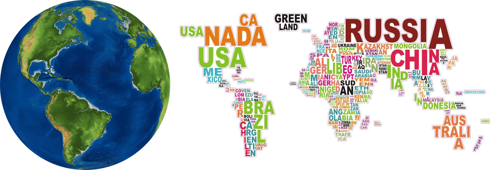
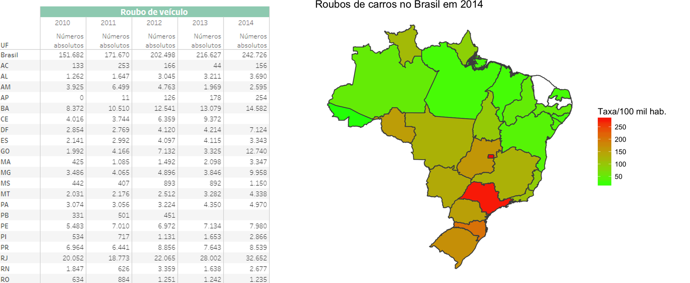
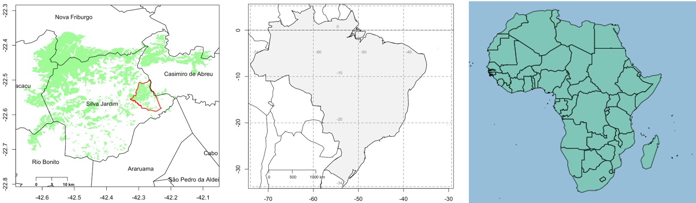
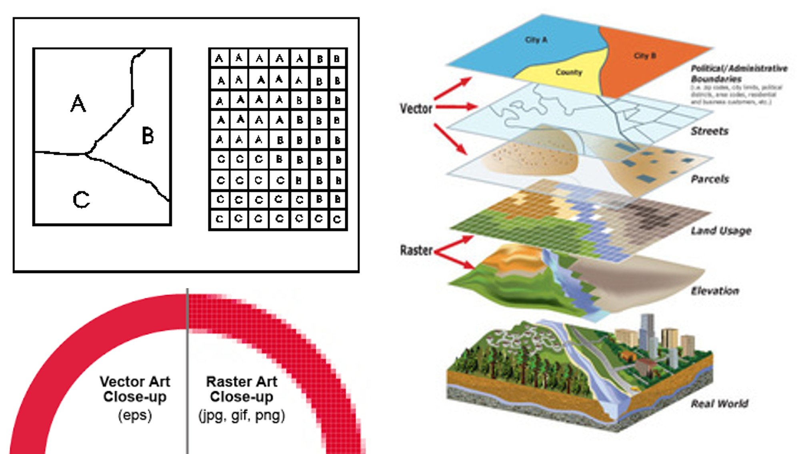
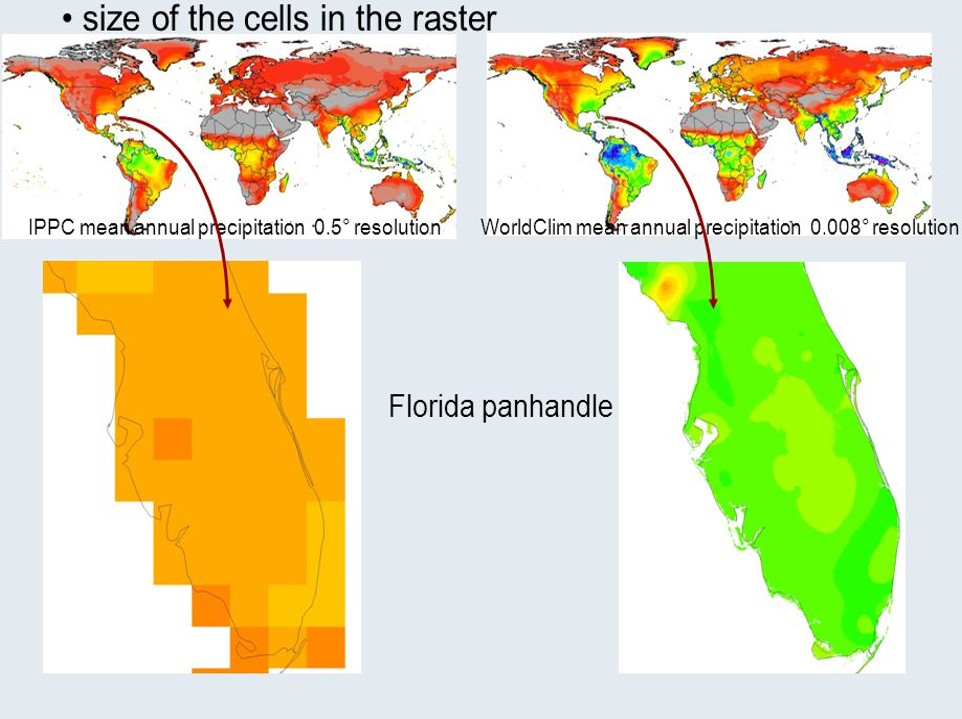
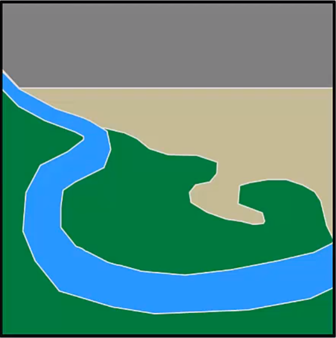
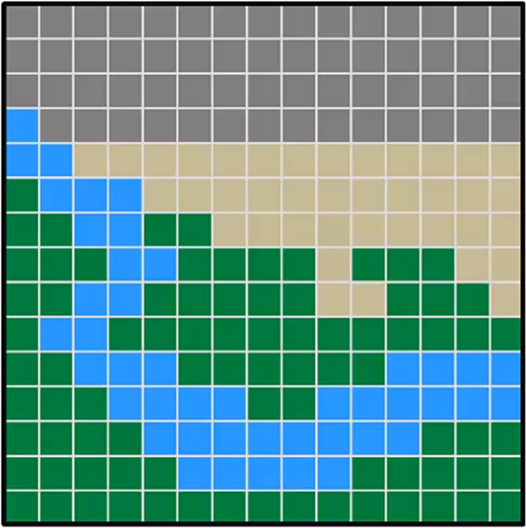

```{r setup, include=FALSE}
knitr::opts_chunk$set(echo = FALSE,
                      prompt = T,
                      comment = "")
```

# Sistema de Informação Geográfica (SIG) em R | Introdução a manipulação de dados espaciais com R

## Formato de dados espaciais

Neste contexto, ‘dados espaciais’ refere-se a dados de localidades geográficas.

```{r, out.width = "900px", fig.align = "center"}

```

 <center> _"geospatial”     ==>        “spatial"_ </center>

## Formato de dados espaciais

```{r, out.width = "900px", fig.align = "center"}

```


## Representação de dados espaciais no R | Pontos e atributos em um data.frame

+ Abordagem simples 
+ Prático para dados pontuais

```{r, results='asis', echo=FALSE, out.extra='', warning=FALSE}
name <- LETTERS[1:10]
longitude <- c(-116.7, -120.4, -116.7, -113.5, -115.5, -120.8, -119.5, -113.7, -113.7, -110.7)
latitude <- c(45.3, 42.6, 38.9, 42.1, 35.7, 38.9, 36.2, 39, 41.6, 36.9)
stations <- cbind(longitude, latitude)
# Dados simulados de precipitação
set.seed(0)
precip <- (runif(length(latitude))*10)^3
#Podem ser representados por pontos e atributos em um data.frame
wst <- data.frame(longitude, latitude, name, precip, stringsAsFactors = T)
psize <- 1 + precip/500

cat("<table class='container'><tr>")
cat("<td>")
plot(stations, cex=psize, pch=20, col='red', 
main='Precipitation')
text(stations, name, pos=4)
breaks <- c(100, 500, 1000, 2000)
legend("topright", legend=breaks, pch=20, pt.cex=psize, col='red', bg='gray')
cat("</td>")
cat("<td>")
knitr::kable(wst, format = "html", align = "c")
cat("</td>")
cat("</tr></table>")
```
## Representação de dados espaciais no R 

O R não reconhece:

<style>
  .col2 {
    columns: 2 200px;         /* number of columns and width in pixels*/
    -webkit-columns: 2 200px; /* chrome, safari */
    -moz-columns: 2 200px;    /* firefox */
  }
  .col3 {
    columns: 3 100px;
    -webkit-columns: 3 100px;
    -moz-columns: 3 100px;
  }
</style>

<div class="col3">
- o significado especial das duas primeiras colunas

- qual sistema de referência de coordenadas

- qual extensão do objeto

</div>
<br>
<br>
<div class="col2">

```{r, out.width = "300px", fig.align = "center", warning = FALSE}
wst
#knitr::kable(wst, justify = "centred", caption  = "", align = 'c', row.names = 1:nrow(wst))
```

Principais pacote: 

- sp
- raster
- rgdal
- rgeos

</div>

## Representação de dados espaciais no R

```{r, out.width = "700px", fig.align = "center"}

```

```{r, out.width = "700px", fig.align = "center", message=FALSE}
library(raster)
f <- system.file("external/test.grd", package = "raster")
r <- raster(f)
par(mfrow = c(1,2))
plot(r)
#plot(log(r))

r1 <- raster(ncol = 10, nrow = 10)
vals <- 1:ncell(r1)
r1 <- setValues(r1, vals)
plot(r1)
```


## Formato matricial e vetorial | raster e shapefile

```{r, out.width = "800px", fig.align = "center"}

```

# Vetor

---

#### Vetor

<br>

+ Pontos;
+ Linhas;
+ Polígonos;

<center>
{width=70%}
</center>

---

#### Extensão

{width=50%}

---

#### Classes principais em **R**

sp  : pacote central de apoio análise de dados espaciais em R

Define um conjunto de classes para representar dados espaciais que iniciam com **_Spatial_**

<center>
+ {width=80%}
</center>

<div class="col2">

```{r}
wst
coordinates(wst) <- ~longitude+latitude
wst
```

</div>
# Raster

---

#### Raster

```{r, out.width = "1000px", fig.align = "center"}
knitr::include_graphics("./figs/Imagem7.png")
```

---

#### Resolução

```{r, out.height="350px", out.width = "700px", fig.align = "center"}

```

```{r, out.width = "400px", fig.align = "center"}
knitr::include_graphics("http://desktop.arcgis.com/en/arcmap/10.3/manage-data/raster-and-images/GUID-9D873324-5AE8-428B-B3E2-F0DA90962C0F-web.gif")
```

---

#### Extensão

```{r, out.width = "600px", fig.align = "center"}
knitr::include_graphics("https://www.esri.com/arcgis-blog/wp-content/uploads/2017/04/sapa_environment_extent.png")
```

---

#### Classes principais em **_R_**

<div class="col2">

```{r, out.width = "400px", fig.align = "center"}
files <- list.files(path = paste(system.file(package = "dismo"), '/ex', sep = ''), pattern = 'grd', full.names = TRUE )

r00 <- raster(files[1])
r01 <- stack(files)
r03 <- brick(stack(files))

plot(r00)
class(r00)[1]

cat(" ")
cat(".__.")

plot(r01)
class(r01)[1]
class(r03)[1]

#knitr::include_graphics("")
```

</div>

---

#### Exemplos

```{r, echo = T, collapse = T}
r00
r01
```

## O MUNDO REAL
{width=90%}

## Duas formas de representar o MUNDO

<div class="col2">

Vetor: Dados discretos

{width=80%}

Raster: dados contínuos

{width=80%}

</div>

---

{width=100%}

<!-- ## Importante ! -->

<!-- {width=100%} -->


## Raster x Vetor

```{r, out.width = "600px", fig.align = "center"}
knitr::include_graphics("http://desktop.arcgis.com/en/arcmap/10.3/manage-data/raster-and-images/GUID-28F4DF81-C24F-4B14-A3FE-74B9737766D1-web.gif")
```

# Vamos ao tutorial


